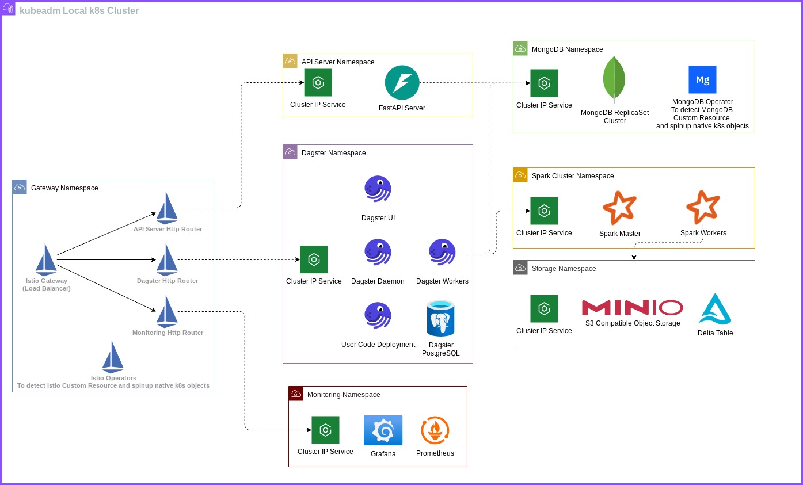

# Overview

This project is a show case for **Kubernetes' [Gateway API]** features. **Gateway API** is a new k8s object to replace the **Ingress** object (**Ingress** features are frozen; all updates will be on **Gateway API** from now on). **Gateway API** has multiple advantages and features over **Ingress**; for instance:

- *Traffic splitting*: define multiple backends with *weights* to control traffic routing. With **Ingress** we need to calcualte the number of pods for each manually 😂; suitable for use cases like *A/B testing*.
- *Supports HTTP/gRPC/TCP/UDP protocols*
- *Better dev experience*: *Gateway API* is designed with three personas in mind (infra operator, cluster operator, and developer), making the API more intuitive and easier to use across roles.
- *Supports both North/South (external/internal) and East/West (mesh) patterns*


In this project, the **[Istio]** is used as the **Gateway API provider** and a single entry point to the system. Then, I define multiple *HTTPRoute* and *TCPRoute* resources to route external requests to internal *ClusterIP Services*.

**Istio Gateway API Operator** will monitor the **Custom Resource** object in the cluster and spinup native *k8s* objects accordingly.



## Highlighted Components

### API Server

1. A [FastAPI] server is utilized as the entry point to *upsert* and *read* data to/from **MongoDB**.
2. We can access two endpoints externally via **Gateway API**.
    - `/external-insert` to insert new data  
    - `/external-read` to read existing data  
3. I also prepared a handy script to quickly generate random data and call the endpoint, as follows:

```bash
just test-insert APISERVER_BASE_URL=<FastAPI url>
```

### Dagster Orchestrator

In this project, *[Dagster]* is used as an orchestrator to demonstrate scheduling capabilities. There is only one toy job to dump **MongoDB** data into a **Delta table**.

---


### Grafana Dashboard

1. The [Prometheus and Grafana] stack is installed in *k8s* to monitor various resources.

---


### MongoDB Cluster

1. **MongoDB Cluster** is installed via [MongoDB helm chart], which installs two main components:  
    1.1 **MongoDB Custom Resource Definitions**: New object kinds defined in *k8s* by registering in *etcd*  
    1.2 **MongoDB Operator**: The operator monitors **MongoDB** objects created in the cluster and, once detected, creates **Services, Deployments,** and **PVCs** accordingly to serve as the **MongoDB cluster**.

## Quick setup to replicate locally

You can replicate the system locally with the following steps:

1. Install [Just]; this project stores all scripts in the **Justfile**
2. Ensure a **Kubernetes cluster** is up and accessible via *kubectl*
3. Then run

```bash
just setup-k8s-cluster # To install Istio & MongoDB CRDs and Operators

just deploy # To deploy all components via Helm charts
```

[Istio]: https://istio.io/
[Gateway API]: https://gateway-api.sigs.k8s.io/
[Dagster]: https://dagster.io/
[FastAPI]: https://fastapi.tiangolo.com/
[Prometheus and Grafana]: https://grafana.com/docs/grafana/latest/getting-started/get-started-grafana-prometheus/
[MongoDB helm chart]: https://github.com/mongodb/helm-charts
[Just]: https://github.com/casey/just?tab=readme-ov-file#packages

